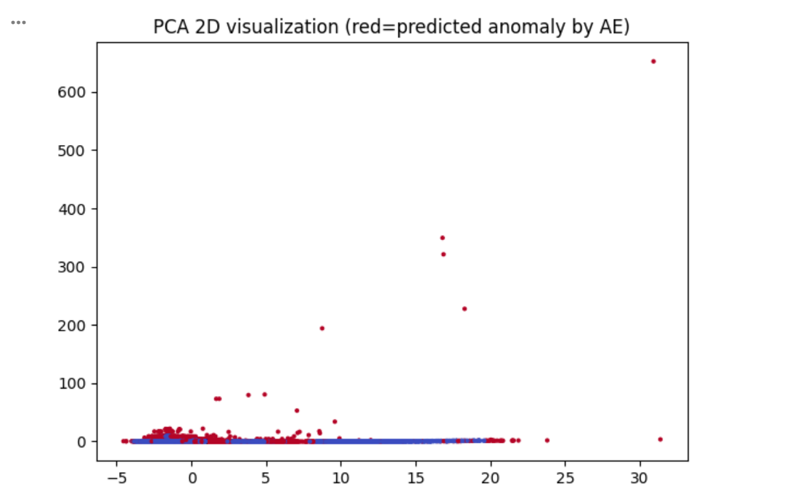
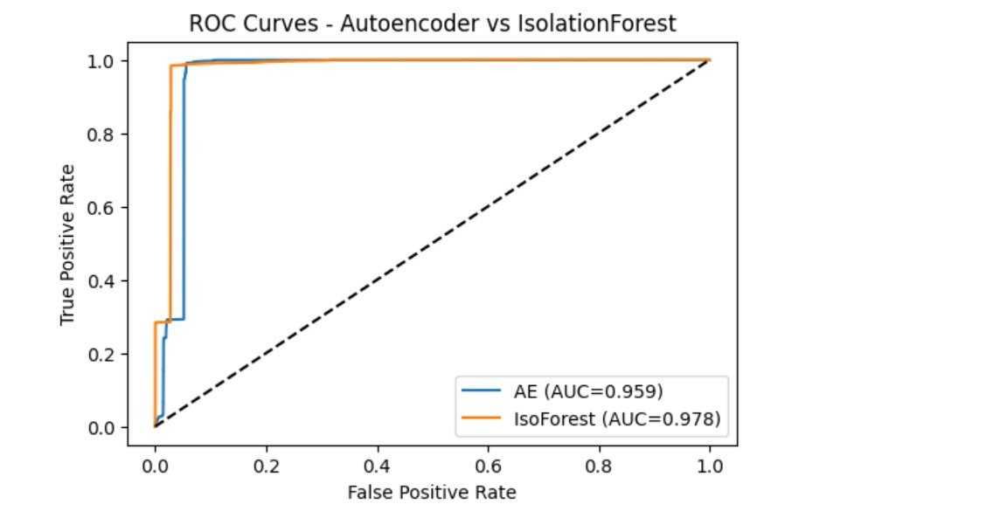
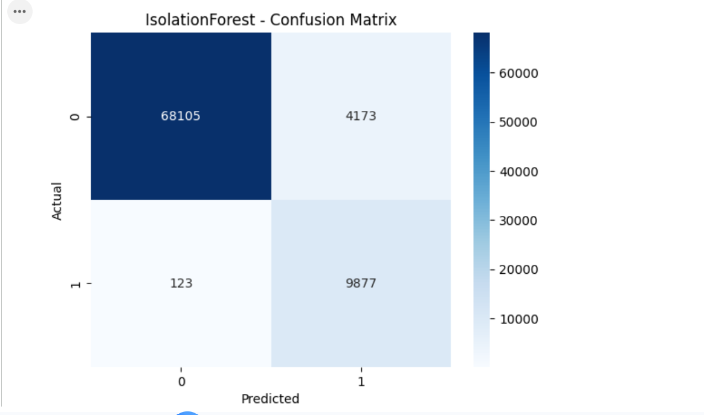
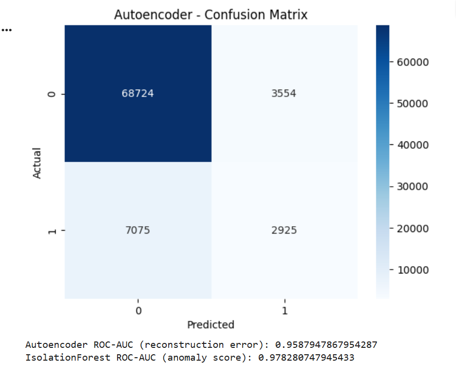

🛡️ Intrusion Detection System (IDS) — Unsupervised Anomaly Detection
By Sneha Gupta

Using Isolation Forest + Autoencoder (Deep Learning) on KDD Cup 1999 Dataset

🚀 Project Overview

This project implements a Network Intrusion Detection System (IDS) using Unsupervised Machine Learning and Deep Learning techniques.
The goal is to automatically detect network anomalies / cyber attacks using:

Isolation Forest (Tree-based anomaly detection)

Autoencoder (Neural network reconstruction error)

The IDS is trained primarily on normal traffic, making it capable of detecting unknown / zero-day attacks, which is a major challenge in cybersecurity.

📁 Dataset — KDD Cup 1999 (10% Corrected)

Industry-standard dataset for network intrusion research

Contains 41 features + attack labels

Used widely in cybersecurity ML studies

Highly imbalanced → perfect for anomaly detection tasks

File used:

kddcup.data_10_percent_corrected

🧠 Models Used
1️⃣ Isolation Forest

Works by isolating anomalies using random partitions

Fast + scalable

Doesn’t require labelled attack data

Returns -1 = anomaly, 1 = normal

2️⃣ Autoencoder (Deep Learning)

Architecture:

Input → Dense(128) → Dense(64) → Dense(Bottleneck)

Decoder → Dense(64) → Dense(128) → Output Layer

Trained only on normal data

Reconstruction error used to classify anomalies

Threshold chosen using 95th percentile reconstruction error on a held-out validation set.

📊 Results
✔ Isolation Forest Performance

Detects anomalies through isolation depth

Quick to train

Good baseline model

✔ Autoencoder Performance

Learns deep representations of normal traffic

High reconstruction error → potential attack

Typically outperforms Isolation Forest in non-linear cases

📈 Evaluation Metrics
## 📊 Visualizations

### 🌀 PCA Anomaly Visualization  

---

### 🔥 ROC Curve  

---

### 🟦 Confusion Matrix — Isolation Forest  

---

### 🟥 Confusion Matrix — Autoencoder  

Confusion Matrix

Classification Report

ROC-AUC Score

PCA Visualization for anomaly clusters

🖥️ How to Run This Notebook
Option 1 — Run directly in Google Colab

Click the badge below:

(Open in Colab button will appear automatically on GitHub)

Upload the dataset file:
kddcup.data_10_percent_corrected

Run all cells sequentially

Models will be saved as:

sneha_iso_model.pkl

sneha_autoencoder.h5

📦 Project Structure
IDS-Anomaly-Detection-KDD99-Sneha/
│
├── IDS.ipynb                # Complete Colab-ready notebook
├── README.md                # This documentation
└── sneha_iso_model.pkl      # (Optional) Saved Isolation Forest model
└── sneha_autoencoder.h5     # (Optional) Saved Autoencoder model

🎯 Key Highlights

Built with Python, Scikit-learn, TensorFlow/Keras

Handles imbalanced data using unsupervised learning

Detects unknown attacks without labeled training data

Includes visualizations: PCA, Confusion Matrix, ROC Curves

Ready for interviews + portfolio + job applications

💡 What I Learned (Interview Points)

Difference between supervised & unsupervised IDS

Why Autoencoders are effective for anomaly detection

How to choose reconstruction error threshold

Handling imbalanced cybersecurity datasets

How anomaly scores are computed in tree-based models

🧩 Future Enhancements

Add LSTM Autoencoder for sequential traffic logs

Build Streamlit-based real-time IDS dashboard

Convert model into API using FastAPI

Deploy IDS on cloud (AWS Lambda / EC2)
